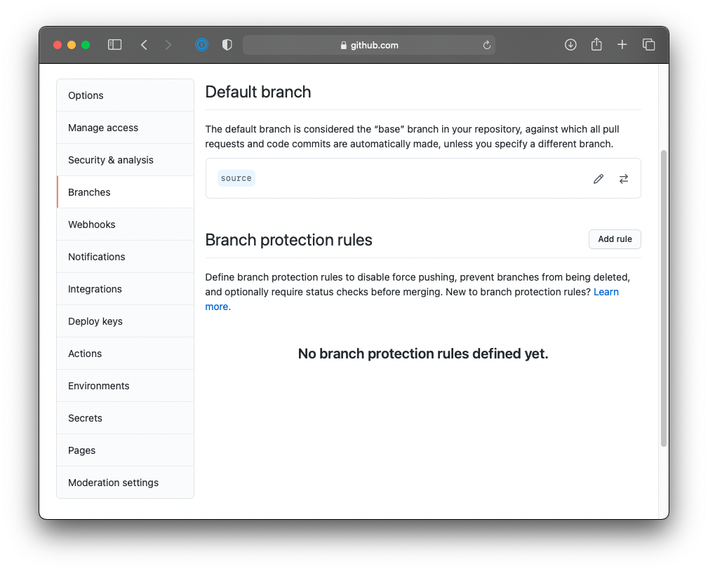

<h1 align="center" style={{marginTop: "2em"}}>macOS Setup Without a Gatsby New Command</h1>

<br/><br/>

Gatsby is a free and open source framework based on React that helps developers build blazing fast **websites** and **apps**.

<br/><br/><br/>

## Software Tools to Install

<br/>

[Xcode](https://developer.apple.com/xcode/) Command Line Tools (macOS):

```bash
xcode-select --install
```

<br/>

[Node](https://nodejs.org/en/) with Homebrew (macOS):

```bash
brew install node
```

<br/>

[Gatsby](https://www.gatsbyjs.com/) CLI (macOS):

```bash
npm install -g gatsby-cli
```

<br/><br/><br/>

## Prepare Your Environment

<br/>

Create new repository in GitHub:


<br/>

Set up a new project folder:

```bash
git clone https://github.com/davidjaimes/davidjaimes.github.io.git
cd davidjaimes.github.io
```

<br/>

Create new branch with git:

```bash
git checkout -b source
```

<br/>

Next, you’ll need to set up **npm** (create package.json file) within your project:

```bash
npm init
```

<br/>

This is my **package.json** file:

```js
{
  "name": "davidjaimes.com",
  "version": "1.0.0",
  "description": "Source code for https://davidjaimes.com",
  "main": "index.jsx",
  "scripts": {
    "test": "echo \"Error: no test specified\" && exit 1"
  },
  "repository": {
    "type": "git",
    "url": "git+https://github.com/davidjaimes/davidjaimes.github.io.git"
  },
  "author": "David Jaimes",
  "license": "MIT",
  "bugs": {
    "url": "https://github.com/davidjaimes/davidjaimes.github.io/issues"
  },
  "homepage": "https://github.com/davidjaimes/davidjaimes.github.io#readme"
}
```

<br/>

Commit your changes:

```bash
git add .
git comment -m "add package.json"
git push --set-upstream origin source
```

<br/><br/><br/>

## Setup GitHub Pages

<br/>

Go to GitHub repository and set **source** branch as default:



<br/>

Then, setup GitHub Pages with custom url and branch chosen is **main**:


<br/>

Install npm gh-pages:

```bash
npm install gh-pages --save-dev
```

<br/>

Install Gatsby as a dependency:

```bash
npm install gatsby react react-dom
```

<br/>

Deploy and publish to **main** branch in repo:

```bash
npm run deploy
```

<br/><br/><br/>

## React packages to install:

<br/>

The best way to consume [React-Bootstrap](https://react-bootstrap.github.io) is via the npm package:

```bash
npm install react-bootstrap bootstrap@4.6.0
```

<br/>

Include popular icons in your React projects easily with [react-icons](https://react-icons.github.io/react-icons):

```bash
npm install react-icons --save
```

<br/><br/><br/>

## Gatsby plugins to install:

<br/>

```bash
npm install gatsby-plugin-react-helmet react-helmet
npm install gatsby-plugin-offline
npm install gatsby-transformer-remark gatsby-remark-prismjs prismjs
npm install gatsby-remark-images gatsby-plugin-sharp
npm install gatsby-plugin-mdx @mdx-js/mdx @mdx-js/react
npm install gatsby-source-filesystem
```

<br/><br/><br/>

## NPM packages to install:

<br/>

**NOTE:** I had to install remark 12.0.1 and remark-math 3.0.1 because remark 13.0.0 and remark-math 4.0.0 did not work for me.

```bash
npm install remark-math rehype-katex
```

<br/><br/><br/>

## Final package.json file:

<br/>

```js
{
  "name": "davidjaimes.com",
  "version": "1.0.0",
  "description": "Source code for https://davidjaimes.com",
  "main": "index.jsx",
  "scripts": {
    "test": "echo \"Error: no test specified\" && exit 1",
    "deploy": "gatsby build && gh-pages -d public -b main"
  },
  "repository": {
    "type": "git",
    "url": "git+https://github.com/davidjaimes/davidjaimes.github.io.git"
  },
  "author": "David Jaimes",
  "license": "MIT",
  "bugs": {
    "url": "https://github.com/davidjaimes/davidjaimes.github.io/issues"
  },
  "homepage": "https://github.com/davidjaimes/davidjaimes.github.io#readme",
  "devDependencies": {
    "gh-pages": "^1.1.0"
  },
  "dependencies": {
    "@mdx-js/mdx": "^1.6.22",
    "@mdx-js/react": "^1.6.22",
    "bootstrap": "^4.6.0",
    "gatsby": "^3.7.1",
    "gatsby-plugin-mdx": "^2.7.1",
    "gatsby-plugin-offline": "^4.7.1",
    "gatsby-plugin-react-helmet": "^4.7.1",
    "gatsby-plugin-sharp": "^3.7.1",
    "gatsby-remark-images": "^5.4.1",
    "gatsby-remark-prismjs": "^5.4.1",
    "gatsby-source-filesystem": "^3.7.1",
    "gatsby-transformer-remark": "^4.4.1",
    "katex": "^0.13.11",
    "prismjs": "^1.23.0",
    "react": "^17.0.2",
    "react-bootstrap": "^1.6.1",
    "react-dom": "^17.0.2",
    "react-helmet": "^6.1.0",
    "react-icons": "^4.2.0",
    "rehype-katex": "^5.0.0",
    "remark": "^12.0.1",
    "remark-math": "^3.0.1"
  }
}
```

<br/>
