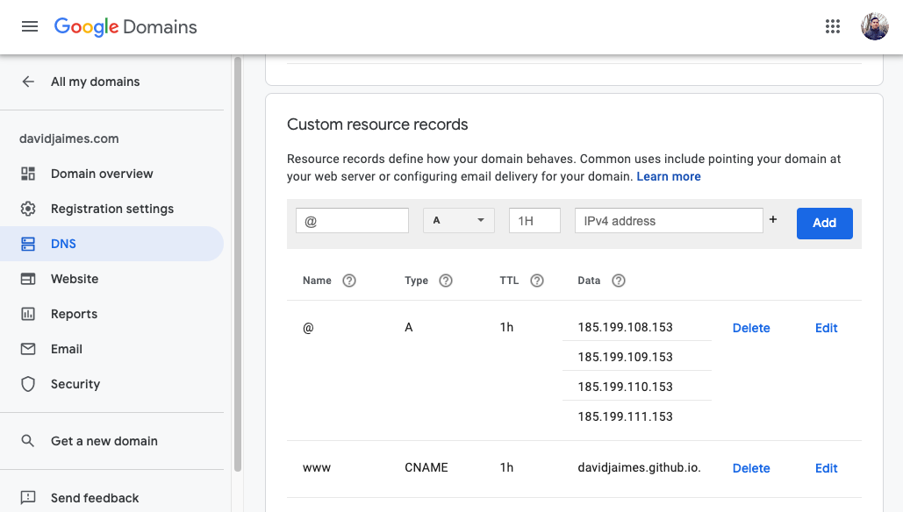

Turn your GitHub respository into an elegant webiste using GitHub Pages. GitHub Pages also supports using custom domains and changing from the default, like `username.github.io`, to any domain you own.

In this tutorial I will show you how to your host own website (domain purchase necessary) and create a custom email address (e.g., `hello@davidjaimes.com`) for free. This is an alternative to using services such as Squarespace, Wix, Google Workspace. That's a savings of $20 USD per month. This tutorial assumes you have a website ready to be published.

<br/>

## Custom Domain
Go to [Google Domains website](https://domains.google) and select your desired personal or professional domain. I went ahead and purchased `https://davidjaimes.com` for $12 USD per year. No need to buy a more expensive domain ending (i.e., `https://davidjaimes.movie` for $320 USD per year).

The first thing to do is head on over to **DNS** settings and create new custom resource records. This [GitHub Docs page](https://docs.github.com/en/pages/configuring-a-custom-domain-for-your-github-pages-site/managing-a-custom-domain-for-your-github-pages-site) gives specific instructions but can be a little confusing to follow because they are not Google Domains specific. Create the `A` record:

```
Host Name    Type    TTL     Data
@            A       3600    185.199.108.153
                             185.199.109.153
                             185.199.110.153
                             185.199.111.153
```

<br/>

Next, create a `CNAME` record and don't forget the period (".") at the end of your data entry:

```
Host Name    Type     TTL     Data
www          CNAME    3600    davidjaimes.github.io.
```



<br/>

## GitHub Account
Setup a free account with [Github](https://github.com) and create a repository with structure `username.github.io`. For example, my repository name is `davidjaimes.github.io` and it set as a public repo and not to private. This will not work if your repo is set to private.

Next, go to **Settings > Pages** and enter your newly acquired domain address in the **Custom domain** field and make sure to check the **Enforce HTTPS** option. Now test your settings by entering the following command into your terminal:

```bash
dig +noall +answer davidjaimes.com
```

This is the ouput:

```
davidjaimes.com.        3055    IN      A       185.199.110.153
davidjaimes.com.        3055    IN      A       185.199.111.153
davidjaimes.com.        3055    IN      A       185.199.109.153
davidjaimes.com.        3055    IN      A       185.199.108.153
```

<br/><br/>

## Custom Email Address
Login into your Google account and go to **Manage Google Account > Security > Signing into to Google > App passwords**. Generate an app password. For example, mine is `itdmwqjhowffvbgj`. Next, go to your Gmail inbox and go to **Settings > See all settings > Accounts and Import > Send mail as** and click on "add another email address".

<br/><br/>
