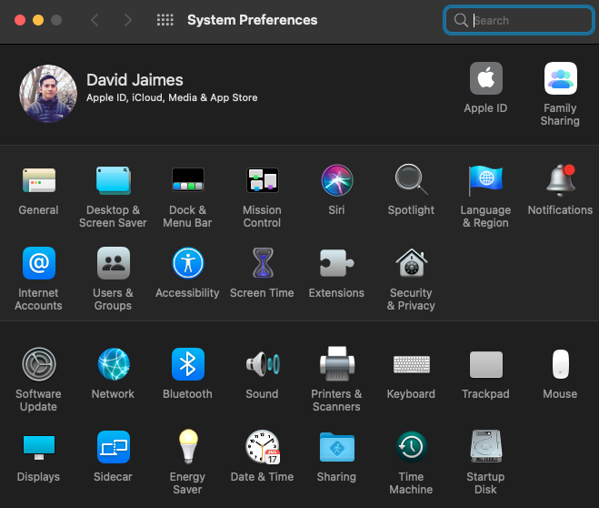

<h1 align="center" style={{marginTop: "2em"}}><b>macOS:</b> System Preferences</h1>

<br/><br/>



<br/><br/>

Install Apple's command line tools.

1. Launch the Terminal application found in your <code>Applications/Utilities</code> directory.
2. Enter this install command:

```bash
xcode-select --install
```

<br/>

3. A pop up window appears and press the Install button. After the installation is done you can enter the <code>gcc -version</code> command and something similar to this should print out:

```shell-session
$ gcc --version

Configured with: --prefix=/Library/Developer/CommandLineTools/usr --with-gxx-include-dir=/Library/Developer/CommandLineTools/SDKs/MacOSX.sdk/usr/include/c++/4.2.1
Apple clang version 12.0.5 (clang-1205.0.22.9)
Target: arm64-apple-darwin20.6.0
Thread model: posix
InstalledDir: /Library/Developer/CommandLineTools/usr/bin
```